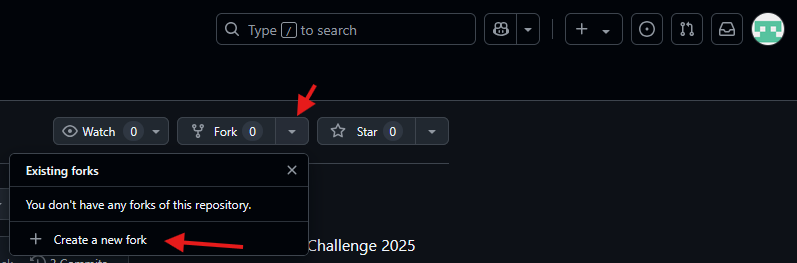
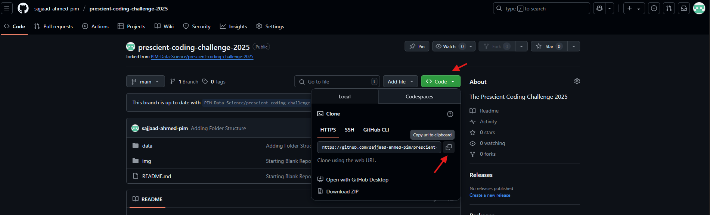
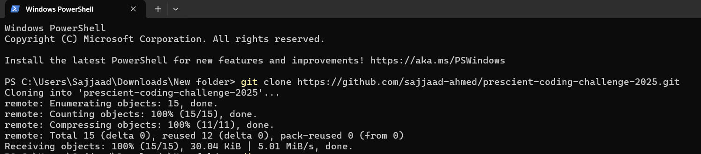
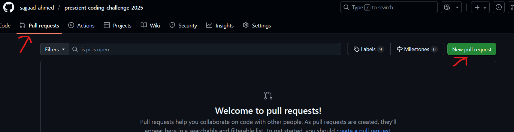
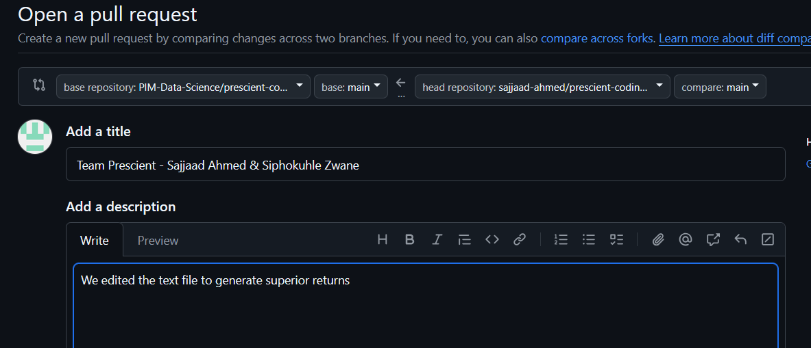
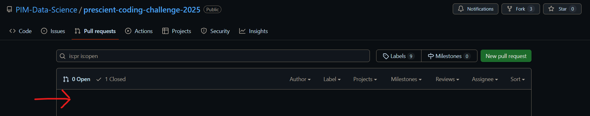

# Welcome!

Welcome to the Prescient Coding Challenge 2025!

## The Problem Description

You have been provided with price and related market data for 10 SA Government Bonds. Your task is to generate 1-day-ahead trading signals for each bond. Additionally, you need to use these signals to select weights each day to form a portfolio. The performance of your selected portfolio will be evaluated based on the total return index over the evaluation (test) period relative to the FTSE/JSE All Bond Index (ALBI).

This type of trading is known as [active bond portfolio management](https://corporatefinanceinstitute.com/resources/career-map/sell-side/capital-markets/active-bond-portfolio-management/). You are only allowed [long positions](https://www.investopedia.com/ask/answers/100314/whats-difference-between-long-and-short-position-market.asp), i.e. your matrix of buys will only contain values between 0 and 0.2.

You are given files

1. `README.md` - this file
2. `data_bonds.csv` - 1st data file
4. `data_albi.csv` - 2nd data file
5. `data_macro.csv` - 3rd data file
6. `solution.py` - a skeleton structure with sample solution for the problem description in Python
7. `solution.R` - a skeleton structure with sample solution for the problem description in R

## The Data

The data provided contains daily data for both the individual bonds as well as the Bond Index.

- The file `data_bonds.csv` contains daily yield, modified duration, convexity and return data for each security and trading day

- The file `data_albi.csv` contains the same data, but for the ALBI.

- The file `data_macro.csv` contains macroeconomic data to assist with generating trading signals.

A brief description of the columns in the data are:

- `datestamp` - close of business day
- `bond_code` - the instrument code
- `bond_name` - the instrument name
- `yield` - the close of day yield
- `modified_duration` - close of day modified duration
- `convexity` - close of day convexity
- `return` - daily return of the instrument at close of day

[Bond Basics Reading](https://www.investopedia.com/articles/bonds/08/bond-market-basics.asp)

[Duration and Convexity Reading](https://madisoninvestments.com/resources/interest-rate-risk-understanding-duration-convexity)

## The Output

We are interested in the total payoff for the portfolio in the testing period `2023-01-03` to `2024-12-31`. The high level steps are:

1. Generate buy-signals
2. Create a buy-matrix of weights, ranging from 0 to 0.2, with each row summing to 1 (i.e. 100% allocation)
3. Generate payoff chart

Your buy-matrix will create your payoff chart using the `plot_payoff` function.

## The Rules

- Your portfolio weights must sum to 100%
- Weights must be positive, ranging from 0% to 20%. 
- The modified duration of your portfolio on each day must be within 1.5 of the ALBI. e.g. If the modified duration of the ALBI on a given day is 6, your portfolio's modified duration must be between 4.5 and 7.5.
- You will face trading costs when repositioning the portfolio. This is calculated as 0.01% * portfolio modified duration * turnover. For example, if you change 20% of the portfolio's holdings on a given day, and the portfolio initially had a modified duration of 7, the trading cost is 0.01% * 7 * 20% = 0.014% for the day
- You may not use any external data sets in your model
- Your script must run from start to end within 10 minutes

## Hints

- You may use a subset of the data.
- You may engineer features using the existing features.
- You may use pure rule based, quant, or ML methods.
- You may create more than 1 model to generate buy-signals
- ChatGPT is allowed

## Running the Sample Solution

- We have included a requirements.txt file with the required modules for the python solution.
- You can install these by running the below in the terminal
```bash
python -m pip install -r requirements.txt
```
- The list of required R packages are included in the sample solution, along with the code to install them if not already installed.
- You may use other packages if required for your own solution.

## Getting The Project On Your Computer (GitHub)


1. Sign in or sign up to GitHub.
2. On the Coding Challenge repo page, fork the repo as shown below.



3. Once the project shows as a repo on your GitHub profile, clone the repo.



4. Open a terminal in the folder you will be working in, and run `git clone "your https url"`



4. Since this is on your personal GitHub profile, you can work on your `main` branch.

## How To Submit Your Answer

1. Assuming you are working on your `main` branch
2. `git add .`
3. `git commit -m 'Your Team Name'`
4. `git push origin main`
5. Make sure that your changes are only in one of either a `solution.py` or a `solution.R`.
6. You should see your changes on your repo.
7. On the "Pull Requests" tab, select "New pull request"



8. The GitHub summary should mention only 1 file change
9. Select "Create pull request"
10. Add your team name and short description of how you solved the problem. Confirm the "Create pull request"



11. You should now be able to see your team's pull request on our repository's list of pull requests.




## Grading Guide

The table below is the 1st grading guide.

| Step | Criteria                                                                 | Action                                         |
|------|--------------------------------------------------------------------------|------------------------------------------------|
| 1    | Submitted on 20 September 2025 before 2pm?                                  | Yes - next step, no - disqualified             |
| 2    | No tampering with data sets and no additional data imports of any kind?                                              | Yes - next step, no - disqualified             |
| 3    | Script runs without intervention from us?                               | Yes - next step, no - disqualified             |
| 4    | Script runs within 10 minutes?                                            | Yes - next step, no - disqualified             |
| 5    | Does it produce the same solution on consecutive runs? Simulation and stochastic estimation needs to be highly stable. | Yes - next step, no - disqualified             |
| 6    | Does not contain look-ahead bias? Hard-coded stock picking in this case will be considered look-ahead because you can see future prices. | Yes - next step, no - disqualified             |
| 7    | Does the solution satisfy the rules? Weights between 0% - 20%, Weights for each day sum to 100%, Active Modified Duration strictly between &plusmn; 1.5         | Yes - next step, no - disqualified             |
| 8    | Successfully feeds into TRI function and produces desired chart?         | Yes - next step, no - disqualified             |

The 2nd grading is a combination of the TRI final level and the solution originality decided by the Prescient Investment Management Team.

# Download Links

1. [Git](https://git-scm.com/downloads)
2. [Python ](https://www.python.org/downloads/)
3. [VS Code](https://code.visualstudio.com/download)
4. [R Base](https://cran.r-project.org/)
5. [R Studio](https://posit.co/downloads/)
